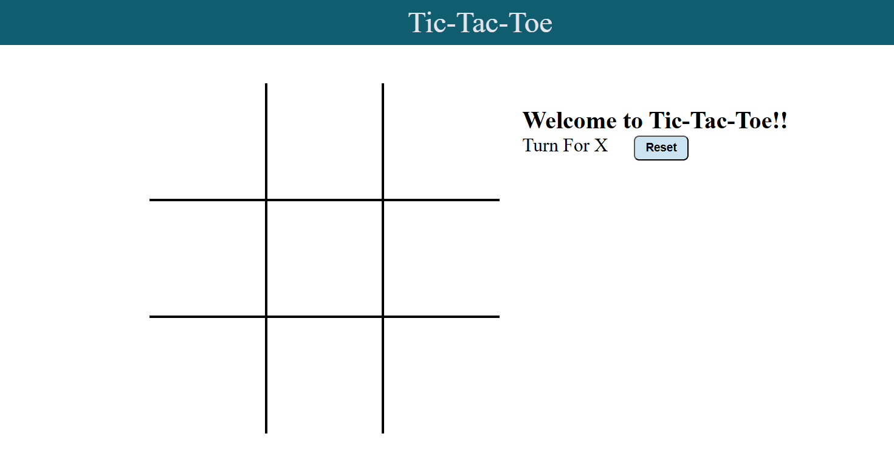
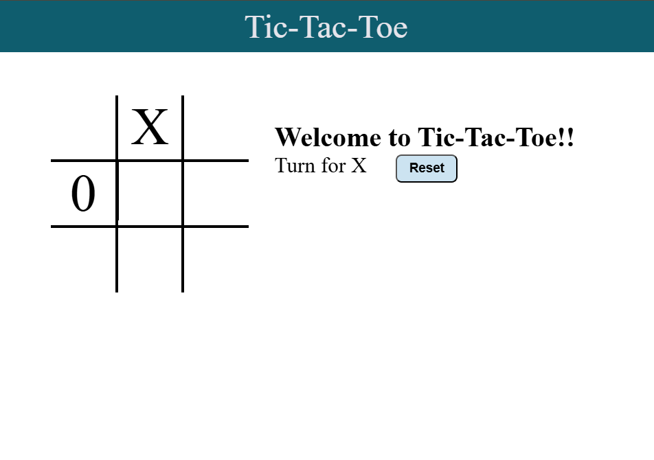
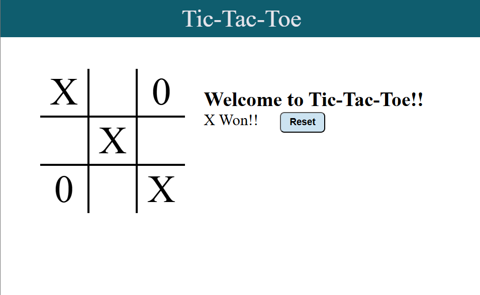

<!-- Replace with project banner -->
<!-- Example:  -->

<div align="center">

# ❌⭕ Tic-Tac-Toe Game

### A clean, responsive Tic-Tac-Toe built with HTML, CSS & JavaScript

[](https://developer.mozilla.org/en-US/docs/Web/HTML)
[](https://developer.mozilla.org/en-US/docs/Web/CSS)
[](https://developer.mozilla.org/en-US/docs/Web/JavaScript)


</div>

---

## 📖 About The Project

**Tic-Tac-Toe Game** is a browser-based version of the classic two-player strategy game, built entirely with **HTML, CSS, and JavaScript** — no frameworks, no dependencies.

It was built as a hands-on project to practice and demonstrate **core front-end development skills**: DOM manipulation, event handling, conditional game logic, and responsive UI design.

**Why this project?**
- To strengthen fundamentals in JavaScript logic (win/draw conditions, turn management)
- To practice building clean, interactive UIs without relying on external libraries
- To create a lightweight, easy-to-understand reference project for interactive web games

**Built with:**
- 🧱 **HTML** — game structure and layout
- 🎨 **CSS** — styling and responsive design
- ⚙️ **JavaScript** — game logic and interactivity

---

## ✨ Features

| Feature | Description |
|---|---|
| 🎮 Interactive Gameplay | Click-based 3x3 grid where players place their marks in real time |
| 👥 Two-Player Mode | Local multiplayer — take turns with a friend on the same device |
| 🏆 Win Detection | Automatically detects and announces the winning player |
| 🤝 Draw Detection | Detects when the board is full with no winner and displays the result |
| 🔄 Reset/Restart | Restart the game instantly without reloading the page |
| 📱 Responsive Design | Adapts smoothly to different screen sizes |
| 🧼 Clean, Minimalistic UI | Simple, distraction-free interface focused on usability |
| ⚡ Lightweight & Fast | No external dependencies — loads and runs instantly |

---

## 🛠️ Tech Stack

<div align="center">


</div>

| Technology | Purpose |
|---|---|
| **HTML5** | Semantic structure of the game board and UI |
| **CSS3** | Styling, layout, and responsive design |
| **JavaScript (Vanilla)** | Game logic, state management, and DOM interaction |

---

## 📁 Project Structure

```
Tic-Tac-Toe_Game/
├── INDEX.HTML      # Main HTML file — game structure & entry point
├── style.css       # Stylesheet — layout, colors, responsive design
├── script.js       # Game logic — moves, win/draw detection, reset
└── README.md       # Project documentation
```

---

## 🎯 How The Game Works

1. The game starts with an empty 3x3 grid and **Player X** goes first.
2. Players click on an empty cell to place their mark (**X** or **O**).
3. After each move, the game checks all possible winning combinations (rows, columns, diagonals).
4. If a player completes a winning line, the game announces the winner and stops accepting moves.
5. If all 9 cells are filled with no winner, the game declares a **draw**.
6. Players can hit **Restart** at any point to reset the board and play again.

---

## 🚀 Installation

Clone the repository and open the game locally — no build tools or servers required.

```bash
# Clone the repository
git clone https://github.com/Aish1506-k/Tic-Tac-Toe_Game.git

# Navigate into the project folder
cd Tic-Tac-Toe_Game

# Open INDEX.HTML in your browser
```

> 💡 On most systems, you can simply double-click `INDEX.HTML`, or right-click → **Open with** → your preferred browser.

---

## ▶️ Usage

1. Open the game in your browser.
2. **Player X** and **Player O** take turns clicking on the grid.
3. Watch the board update in real time as each move is made.
4. When a player wins or the game ends in a draw, the result is displayed.
5. Click **Restart** to play another round.

---

## 🖼️ Screenshots

> Screenshots to be added — placeholders below.

### Home Screen


### Gameplay


### Winner Screen


---

## 🔮 Future Improvements

<details>
<summary>Click to expand planned enhancements</summary>

- 🤖 Single-player mode with AI opponent
- 🎚️ Adjustable difficulty levels
- 🔊 Sound effects for moves, wins, and draws
- 🌐 Online multiplayer support
- 🧮 Scoreboard to track wins/losses/draws across sessions
- 🎨 Theme customization (dark mode, custom colors)

</details>

---

## 📚 Learning Outcomes

Through building this project, key concepts practiced and reinforced include:

- DOM manipulation and event-driven programming in vanilla JavaScript
- Implementing game logic and conditional state checks (win/draw detection)
- Structuring semantic, accessible HTML
- Writing responsive CSS layouts without frameworks
- Debugging and testing interactive UI behavior across devices

---


<div align="center">

⭐ If you liked this project, consider giving it a star on GitHub!

</div>
